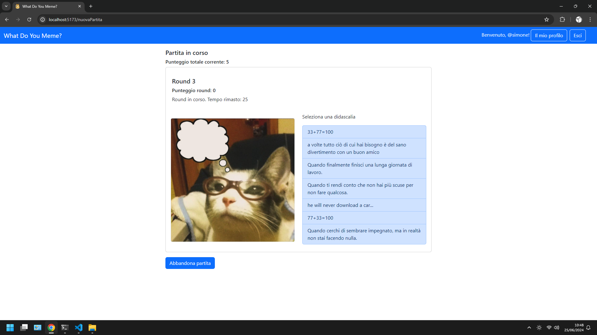
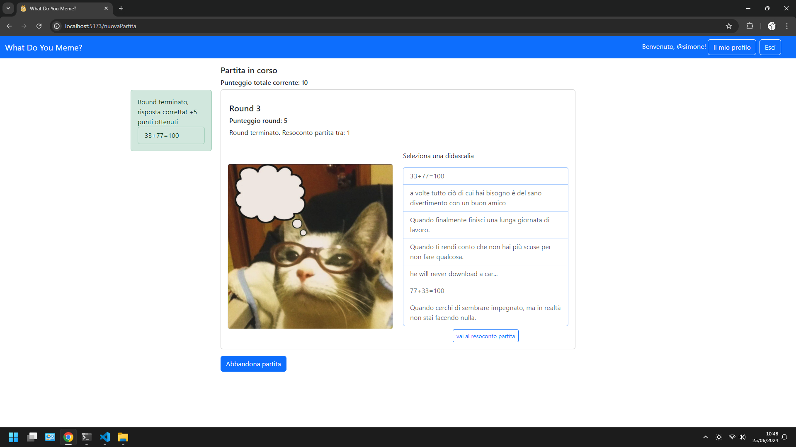

# Exam #1: "Gioco dei Meme"
## Student: s333017 TUMMINELLI SIMONE 

## Requirements, Dependencies
- Dependencies: node, react (everything else: in package.json, just npm install)
- Requirements: [requirements](./requirements.pdf)

## React Client Application Routes

- Route `/`: homepage del sito. Contiene i pulsanti per avviare una nuova partita, per leggere le regole del gioco e per effettuare operazioni di autenticazione (login, logout, registrazione).
- Route `/home`: route alternativa per `/`.
- Route `/nuovaPartita`: schermata di gioco della partita. Permette di giocare il numero di round previsti e mostra il riepilogo dei round alla fine della partita.
- Route `/cronologiaPartite`: schermata del profilo dell'utente, accessibile solo dopo essersi autenticati. Contiene la cronologia completa delle partite giocate dall'utente.
- Route `/accedi`: schermata di accesso. Contiene un form in cui inserire username e password.
- Route `/registrazione`: schermata di registrazione di un nuovo utente. Contiene un form in cui inserire username e password.
- Route `*`: schermata generica di errore per route inesistente.

## API Server

- GET `/api/nuovaPartita`
  - Scopo: ottenere una nuova partita generata dal server.
  - Parametri della richiesta: nessuno. Nella richesta sono incluse le credenziali dell'utente nel caso in cui sia loggato.
  - Contenuto della risposta: status `200` (success) e partita in formato json generata dal server con meme e didascalie casuali. Il campo "data" della partita e i campi "didascaliaSelezionata" dei round sono nulli, predisposti per la compilazione delle informazioni necessarie dal client (scelta presa per mantenere la stessa struttura di oggetti tra client e server). La partita ha tre round se l'utente è specificato, altrimenti ne ha uno. In caso di errore: status `500` (internal server error) e messaggio di errore.
    ```
    req.user: {
        "utenteID": utenteID,
        "username": username
    }
    ```
  
    ```
    res.body: {
        "partitaID": null,
        "utenteID": utenteID,
        "punteggio": 0,
        "data": null,
        "rounds": [{
            "roundID": null,
            "meme": {
                "memeID": memeID,
                "nomeFile": nomeFile
            },
            "didascalie": [{
                "didascaliaID": didascaliaID,
                "testo": testo
            }],
            "didascalieCorrette": [{
                "didascaliaID": didascaliaID,
                "testo": testo
            }],
            "didascaliaSelezionata": null,
            "punteggio": 0
        }]
    }
    ```

- POST `/api/nuovaPartita`
  - Scopo: salvare nel database una partita terminata giocata da un utente loggato.
  - Parametri della richiesta: nessuno. Nella richiesta sono incluse le credenziali utente (obbligatorio). Contenuto del body: partita in formato json contenente i dati salvati durante la partita.
  - Contenuto della risposta: status `201` (created) se la partita è stata salvata correttamente nel database. In caso di body non valido: status `422` (unprocessable entity) e messaggio di errore di validazione. In caso di errore: status `500` (internal server error) e messaggio di errore.
    ```
    req.user: {
        "utenteID": utenteID,
        "username": username
    }
    ```
    ```
    req.body: {
        "partitaID": null,
        "utenteID": utenteID,
        "punteggio": punteggio,
        "data": data,
        "rounds": [{
            "roundID": null,
            "punteggio": punteggio
            "meme": {
                "memeID": memeID,
                "nomeFile": nomeFile
            },
            "didascalie": [{
                "didascaliaID": didascaliaID,
                "testo": testo
            }],
            "didascalieCorrette": [{
                "didascaliaID": didascaliaID,
                "testo": testo
            }],
            "didascaliaSelezionata": [{
                "didascaliaID": didascaliaID,
                "testo": testo
            }],
        }]
    }
    ```  

- GET `/api/cronologiaPartite`
  - Scopo: ottenere la lista delle partite giocate dall'utente loggato.
  - Parametri della richiesta: nessuno. Nella richiesta sono incluse le credenziali utente (obbligatorio).
  - Contenuto della risposta: status `200` (success) e vettore delle partite dell'utente in formato json. In caso di errore: status `500` (internal server error) e messaggio di errore.
    ```
    req.user: {
        "utenteID": utenteID,
        "username": username
    }
    ```
    ```
    res.body: {[
        "partitaID": partitaID,
        "utenteID": utenteID,
        "punteggio": punteggio,
        "data": data,
        "rounds": [{
            "roundID": roundID,
            "punteggio": punteggio
            "meme": {
                "memeID": memeID,
                "nomeFile": nomeFile
            },
            "didascalie": null
            "didascalieCorrette": [{
                "didascaliaID": didascaliaID,
                "testo": testo
            }],
            "didascaliaSelezionata": {
                "didascaliaID": didascaliaID,
                "testo": testo
            },
        }]
    ]} 
    ``` 

- POST `/api/sessions`
  - Scopo: effettuare il login.
  - Parametri della richiesta: nessuno. Contenuto del body: credenziali utente.
  - Contenuto della risposta: status `200` (success) e utente in formato json (contenente id e username). In caso di credenziali errate: `401` (unauthorized access) e messaggio di errore, in caso di errore: status `500` (internal server error) e messaggio di errore.
  ```
  req.body: {
    "username": username,
    "password": password
  }
  ```
  ```
  res.body: {
    "utenteID": utenteID,
    "username": username
  }
  ```

- GET `/api/sessions/current`
  - Scopo: controllare che l'utente corrente sia loggato.
  - Parametri della richiesta: nessuno. Nella richiesta sono incluse le credenziali utente (obbligatorio).
  - Contenuto della risposta: status `200` (success) e utente loggato in formato json. In caso di utente non loggato `401` (unauthorized access) e messaggio di errore, in caso di errore: status `500` (internal server error) e messaggio di errore.
  ```
  req.user: {
    "utenteID": utenteID,
    "username": username
  }
  ```
  ```
  res.body: {
    "utenteID": utenteID,
    "username": username
  }
  ```

- DELETE `/api/sessions/current`
  - Scopo: effettuare il logout.
  - Parametri della richiesta: nessuno. Nella richiesta sono incluse le credenziali utente (obbligatorio).
  - Contenuto della risposta: status `204` (no content), in caso di errore status `500` (internal server error) e messaggio d'errore.
  ```
  req.user: {
    "utenteID": utenteID,
    "username": username
  }
  ```

- POST `/api/nuovoUtente`
  - Scopo: registrare un nuovo utente.
  - Parametri della richiesta: nessuno. Contenuto del body: credenziali dell'utente da registrare.
  - Contenuto della risposta: status `201` (created) e id e username dell'utente appena creato; se l'username esiste già: status `409` (conflict) e messaggio di errore, in caso di errore: status `500` (internal server error) e messaggio di errore.
  ```
  req.body: {
    "username": username,
    "password": password
  }
  ```
  ```
  res.body: {
    "utenteID": utenteID,
    "username": username
  }
  ```

## Database Tables

- Tabella `utenti` - contiene:
  - utenteID: chiave primaria unica di tipo numerico auto-incrementale, valore non nullo
  - username: valore unico di tipo testuale non nullo
  - hashedPassword: valore di tipo testuale non nullo
  - salt: valore di tipo testuale non nullo

- Tabella `meme` - contiene:
  - memeID: chiave primaria unica di tipo numerico auto-incrementale, valore non nullo
  - nomeFile: valore di tipo testuale non nullo

- Tabella `didascalie` - contiene:
  - didascaliaID: chiave primaria unica di tipo numerico auto-incrementale, valore non nullo
  - testo: valore di tipo testuale non nullo

- Tabella `didascalieInMeme` - la relazione tra `meme` e `didascalie` è molti a molti, questa tabella rappresenta la relazione tra meme e le rispettive didascalie, contiene:
  - memeID: chiave esterna riferita alla tabella `meme`, valore non nullo
  - didascaliaID: chiave esterna riferita alle tabella `didascalie`, valore non nullo

- Tabella `partite` - contiene:
  - partitaID: chiave primaria unica di tipo numerico auto-incrementale, valore non nullo
  - utenteID: chiave esterna riferita alla tabella `utenti`, valore non nullo
  - punteggio: valore di tipo intero non nullo
  - data: valore di tipo testuale non nullo

- Tabella `round` - contiene:
  - roundID: chiave primaria unica di tipo numerico auto-incrementale, valore non nullo
  - partitaID: chiave esterna riferita alla tabella `partite`, valore non nullo
  - memeID: chiave esterna riferita alla tabella `meme`, valore non nullo
  - didascaliaSelezionataID: chiave esterna riferita alla tabella `didascalie`, il valore può essere nullo
  - punteggio: valore di tipo intero non nullo

- Tabella `didascalieInRound` - la relazione tra `round` e `didascalie` è molti a molti, questa tabella rappresenta la relazione tra un round e le rispettive didascalie proposte, contiene:
  - didascaliaID: chiave esterna riferita alla tabella `didascalie`, valore non nullo
  - roundID: chiave esterna riferita alla tabella `round`, valore non nullo


## Main React Components

- `MyHeader` in (`MyHeader.jsx`): header comune a tutte le schermate del sito. Consente di effettuare il logout e di navigare verso le pagine home, login, profilo e registrazione. 

- `Home` (in `Home.jsx`): schermata home del sito, consente di visualizzare le istruzioni di gioco (`ModaleRegoleGioco`) e navigare verso la pagina di nuova partita.

- `ModaleRegoleGioco` (in `Home.jsx`): modale contenente un paragrafo di spiegazione delle regole del gioco e del funzionamento del sito, ha un pulsate per navigare verso la pagina di nuova partita.

- `AccediForm` (in `ComponentiAutenticazione.jsx`): form per effettuare il login.

- `LogoutButton` (in `ComponentiAutenticazione.jsx`): pulsante per effettuare il logout.

- `Partita` (in `Partita.jsx`): schermata di gioco, visualizza `RoundDiGioco` durante i round e `RiepilogoPartita` alla fine di tutti i round.

- `RiepilogoPartita` (in `Partita.jsx`): schermata di riepilogo partita, mostra informazioni diverse in base al contesto: alla fine di una partita appena giocata mostra solo il punteggio ottenuto e le immagini di meme con didascalia selezionata associata (`CardMeme`) dei round che hanno un punteggio ottenuto diverso da 0; invece nella cronologia dell'utente mostra anche la data e le `CardMeme` di ogni round indipendentemente dal punteggio.

- `RoundDiGioco` (in `RoundDiGioco.jsx`): schermata di gameplay con un'immagine di meme e 7 didascalie selezionabili. Mostra due diversi `CountDown` in base al fatto che il round sia in corso oppure no, le didascalie mostrate fanno parte del componente `ListaDidascalie`.
  - Precisazione sul funzionamento dei round e countdown: la durata del round è di 30 secondi, durante i quali si può selezionare una didascalia. Quando si seleziona una didascalia o allo scadere dei 30 secondi inizia un altro countdown di 6 secondi durante i quali le didascalie non sono più selezionabili, si aggiornano a schermo alcuni dati (didascalia del countdown e punteggio totale della partita) e viene visualizzato un messaggio di feedback contentenente le informazioni riguardo alla fine del round, alla didascalia selezionata e ai punti ottenuti. Tramite un pulsante apposito si può andare al round successivo (o andare al riepilogo della partita nel caso in cui ci si trovi all'ultimo round della partita) senza dover necessariamente aspettare.

- `CountDown` (in `RoundDiGioco.jsx`): conto alla rovescia durante il gameplay, durante il round mostra la didascalia "round in corso:", quando il round finisce mostra la didascalia "prossimo round tra:".

- `ListaDidascalie` (in `RoundDiGioco.jsx`): lista delle didascalie proposte durante un round. Sono selezionabili solo durante i 30 secondi del round.

- `FeedbackDidascalie` (in `RoundDiGioco.jsx`): messaggio di resoconto del round al termine dello stesso. Mostra diversi messaggi nei casi in cui la didascalia sia non selezionata, selezionata corretta o selezionanta errata; in tutti e tre i casi sono mostrati i relativi punteggi ottenuti.

- `CardMeme` in (`CardMeme.jsx`): componente contenente l'immagine di un meme di un round, la relativa didascalia selezionata dall'utente e il punteggio ottenuto.

- `CronologiaPartite` (in `CronologiaPartite`): schermata del profilo utente contenente l'username dell'utente, delle statistiche sulle partite e la lista di componenti `RiepilogoPartita` con informazioni complete.

- `RegistratiForm` (in `ComponentiAutenticazione.jsx`): form per effettuare la registrazione.

## Screenshot





## Users Credentials

- username: `test`, password: `aaa` (utente che ha delle partite nella cronologia)
- username: `newuser`, password: `psw1` (utente che non ha ancora giocato partite)
